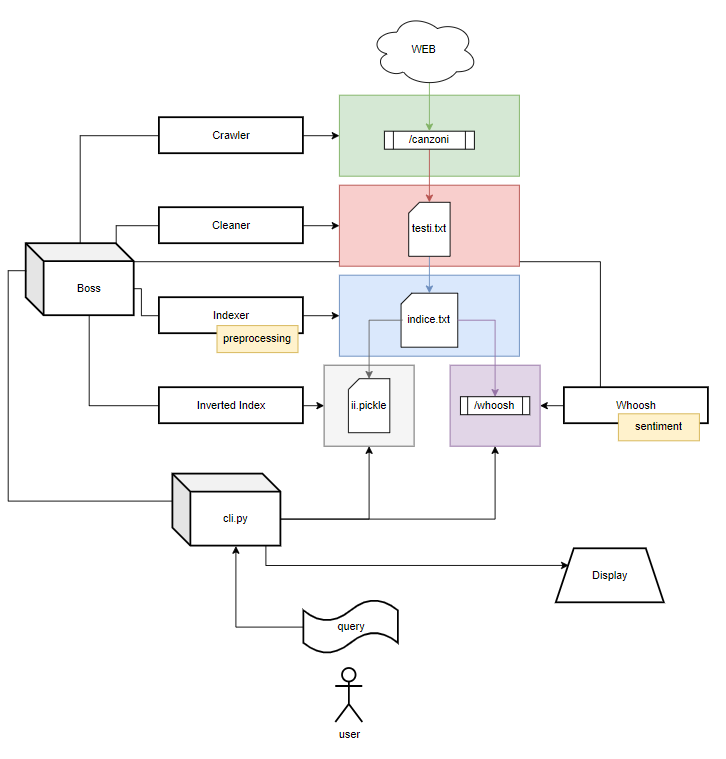
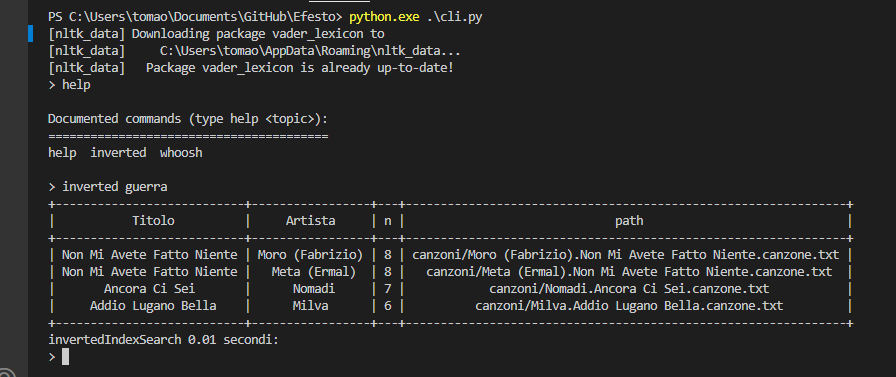
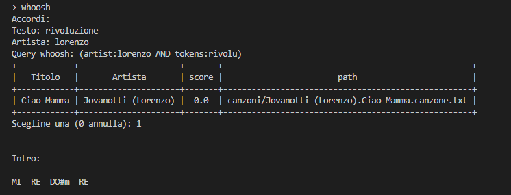
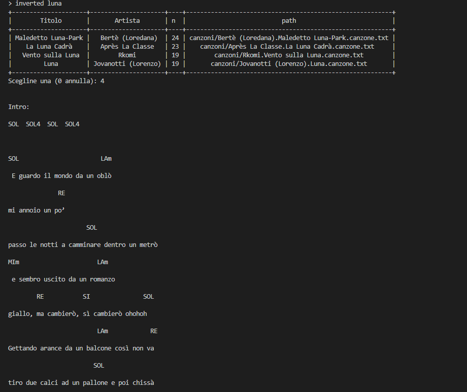

<link rel="stylesheet" href="https://www.w3schools.com/w3css/4/w3.css">

# Progetto gestione dell'informazione
<div class="w3-center">
<h3>Paoli Tommaso <b>152542</b><h3>
</div>



<p style="page-break-after: always;">&nbsp;</p>

## Panoramica
Il progetto consiste nella creazione di un motore di ricerca e nella amministrazione dei dati che il motore dovrà utilizzare per soddisfare le ricerche degli utenti. Si è deciso di raccogliere i dati da un sito di testi e accordi di canzoni italiane e inglesi

# Indice
1. Preparazione dei dati
   - Recupero dei dati
   - Preprocessing dei dati
2. Preparazione degli indici
   - Inverted Index
   - Whoosh
3. Ricerche
   - Interfaccia utente
   - Composizione query
- Preprocessing
- Sentiment analysis
- main.py

...è stata omessa la maggiorparte della documentazione tecnica sulla architettura del software e sulle scelte di programmazione.
  
<p style="page-break-after: always;">&nbsp;</p>

# 1. Preparazione dei dati
Il corpus di documenti viene preparato in due parti: i file vengono scaricati dal sito e poi vengono preparati per le strutture dati attue alla ricerca.

**crawler**: Scarichiamo il corpus di documenti dal sito <a href="https://www.accordiespartiti.it/">***accordiespartiti.it***</a>
- tramite il modulo *request* scaricheremo delle pagine dal sito per ogni **artista** e guarderemo tute le sue **canzoni** scaricandone sia il **testo** sia gli **accordi**
- Ogni canzone verrà salvata come file di testo proprio come appare sul sito e avrà come nome: ***[nome artista].[nome canzone].canzone.txt***

**cleaner**: Per lavorare con tutti questi dati abbiamo preferito "ordinarli"
- Questo strumento guarderà tutte le canzoni scaricate in precedenza dal crawler
- Rimuove righe e spazi vuoti
- Rimuove le righe per le tablature (se presenti)
- Racchiude tutto in unico file ***testi.txt*** contenente, per ogni riga, una canzone:
  - nome artista
  - ___ PUNTO ___
  - titolo canzone
  - ___ SEPARATORE ___
  - testo canzone
  - ___ SEPARATORE ___
  - set degli accordi

I separatori sono solo dei caratteri arbitrari scelti dal programmatore per semplificare il codice " { } "

**indexer**:
In previsione di preparare l'**inverted index** e **whoosh** si è preferito attuare un'operazione molto "laboriosa" subito
- Questo strumento prendera il file ***testi.txt*** riscrivendolo
- Sostituisce però tutti i testi con gli stessi testi "preprocessati"
  - Rimarranno unicamente i token in forma base delle parole "significanti" presenti più volte con annessa la loro "frequenza"
- Questa operazione è risultata essere la più "costosa" per il sistema

<p style="page-break-after: always;">&nbsp;</p>


# 2 Preparazione degli indici
**invertedIndex**: Tramite le funzionalità base del python creiamo il nostro **inverted index**
- Tramite il modulo pickle salveremo il nostro "insieme di liste" all'interno di un file
  
**whoosh**: 
Lo schema sarà cosi:
<table>
<tr><th>titolo</th><th>artista</th><th>tokens</th><th>accordi</th><th>Punteggio sentiment</th></tr>
<tr>
<td>Titolo della canzone</td>
<td>Nomi degli artisti della canzone</td>
<td>Lista dei token principali della canzone</td>
<td>Set degli accordi</td>
<td>Punteggio di sentiment associato al testo e al titolo della canzone</td>
</table>

# Sentiment analysis
Le ricerche tramite whoosh daranno come risultato anche un campo "score". Esso sarà il punteggio calcolato in base alla sentiment analysis attraverso la classe nel file ***snenerizer.py*** che vengono fatte durante la costruzione dell'indice. 
Per effettuare questa operazione è stato utilizzato **SentimentIntensityAnalyzer** direttamente da nltk.

```python
import nltk
from nltk.sentiment import SentimentIntensityAnalyzer
nltk.download('vader_lexicon')

class Snenerizer:
    def __init__(self):
        self.sia = SentimentIntensityAnalyzer()

    def analizza(self, text):
        score = self.sia.polarity_scores(text)['compound']
        return score
```

Per il momento lo strumento funziona con i testi in inglese. Le ricerche che daranno risultati canzoni con termini in inglese avranno uno score diverso da 0


<p style="page-break-after: always;">&nbsp;</p>


# 3. Ricerche
Per testare il progetto si è deciso di preparare un'interfaccia a linea di comando che, una volta avviata andrà a caricarsi gli indici creati in precedenza, e permetterà all'utente di specificare se vuole fare una ricerca di una parola tramite **inverted index** o fare una ricerca più "approfondita" tramite **whoosh**

L'utente tramite il file /cli.py potrà avviare un'interfaccia a linea di comando da cui poter provare a effettuare delle ricerche


Le ricerche tramite l'inverted index effettueranno la ricerca di un unico termine tra i token delle canzoni e mostreranno una colonna con la quantità delle volte che quella parola appare nel testo


Le ricerche tramite whoosh potranno essere arricchite specificando se si vuole cosa cercare nel testo, nel nome dell'artista o negli accordi. (si è preferito evitare la ricerca nel titolo) e mostreranno una colonna che contiene lo "score" ottenuto dal testo. Lo score si basa sul calcolo della sentiment analysis che purtroppo non è ancora stata implementata in lingua italiana. Solo nei testi in cui appariranno termini in inglese il punteggio non sarà 0

<p style="page-break-after: always;">&nbsp;</p>


# Preprocessing
Durante la preparazione del file *indice.txt* a cura dello strumento **Indexer**; viene lanciato il ***preprocessing*** (dal file preprocessing.py) e quindi ogni testo viene convertito nella lista di token "utili", con annessa la frequenza del token.
Per questo progetto si è deciso di applicare un preprocessing un filo più "aggressivo" del normale, e quindi verranno più spesso ignorate parole anche apparentemente significanti. Inoltre parlando di testi di canzoni si è deciso di non dare la minima importanza all'ordine delle parole ma solo al loro significato e la loro frequenza in ogni testo.
Per quanto riguarda gli accordi si è presa in considerazione la misurazione della tonica di ogni canzone. (Si è deciso di ignorare i cambi di tonalità). Per ogni canzone verrà memorizzato un set con tutti gli accordi apparsi una o più volte.
Dopo aver recuperato i token della canzone, (puliti stemmati e senza stopwords), vengono contate le frequenze all'interno del testo. Infine vengono rimossi tutti i token che non sono presenti almeno 1/3 delle volte che è presente il primo token.

```python
# print(text)
# >>> Hei ciao sto usando whatsapp ciao
tokens = self.A_analysis(text)
# print(tokens)    
# >>> ['Hei', 'ciao', 'sto', 'usando', 'whatsapp', 'ciao']
tokens = self.B_stopwords(tokens)  
# print(tokens)    
# >>> ['Hei', 'ciao', 'usando', 'whatsapp', 'ciao']
tokens = self.C_stemming(tokens)
# print(tokens)    
# >>> ['hei', 'cia', 'usand', 'whatsapp', 'cia']  
index = self.D_count(tokens)
# print(index)     
# >>> [('hei', 1), ('cia', 2), ('usand', 1), ('whatsapp', 1)]
self.index = self.E_sort(index)
# print(self.index)
# >>> [('cia', 2), ('whatsapp', 1), ('usand', 1), ('hei', 1)]
```

Alle fasi studiate nel corso si è deciso di inserire una fase di "count" e una di "sort" che è servita alla programmazione del progetto per avere, non solo una lista di token "puliti", ma con annessa la loro term frequency 

<p style="page-break-after: always;">&nbsp;</p>

# Main.py

Il file main esegue un po tutta la preparazione del corpus di documenti ed effettua una prima ricerca con una parola molto diffusa nei testi in italiano.
Per ogni fase mostrerà anche la durata. Questo sorgente è stato utilizzato per dare una stima iniziale della tempistica in secondi delle varie fasi

```python
   # cancella tutti i documenti e il corpus di documenti ( se presenti )
   Boss.reset(*paths, CANZONI_DIR)

   b = Boss()

   # avvia il crawler e scarica tutte le canzoni
   b.crawler(LINK, CANZONI_DIR)
   
   # avvia il cleaner che da un primo passaggio ai file delle canzoni
   b.cleaner(CANZONI_DIR, TESTI_FILE)

   # Avvia l'indexer che prepara il corpus all'inverted index e l'indice di whoosh
   b.indexer(TESTI_FILE, INDICE_FILE)
   
   # Crea l'inverted index
   b.invertedIndex(INVERTEDINDEX_FILE, INDICE_FILE)
   
   # Crea l'indice whoosh
   b.whoosh(INDICE_FILE, WHOOSH_DIR)
   
   # Seleziona un termine generico da cercare
   cerca = ['amore', 'soldi', 'potere', 'sacrificio', 'forza'][random.randint(0, 4)]
   
   # cerca il termine tramite entrambi gli indici
   print("Vado a cercare la parola:", cerca)
   searchWhoosh(cerca)
   searchInverted(cerca)
```

<table class="w3-table-all">
<tr>
<td></td>
<td>Crawler</td>
<td>Cleaner</td>
<td>Indexer</td>
<td>InvertedIndex</td>
<td>Whoosh</td>
</tr>
<tr>
<th>Secondi</th>
<td>7888.57</td>
<td>80.74</td>
<td>545.86</td>
<td>0.67</td>
<td>14.46</td>
</tr>
</table>


<p style="page-break-after: always;">&nbsp;</p>

# Extra

Per l'utilizzo del search engine è stata aggiunta la possibilità di visualizzare uno dei 4 risultati delle ricerca direttamente dal terminale.
